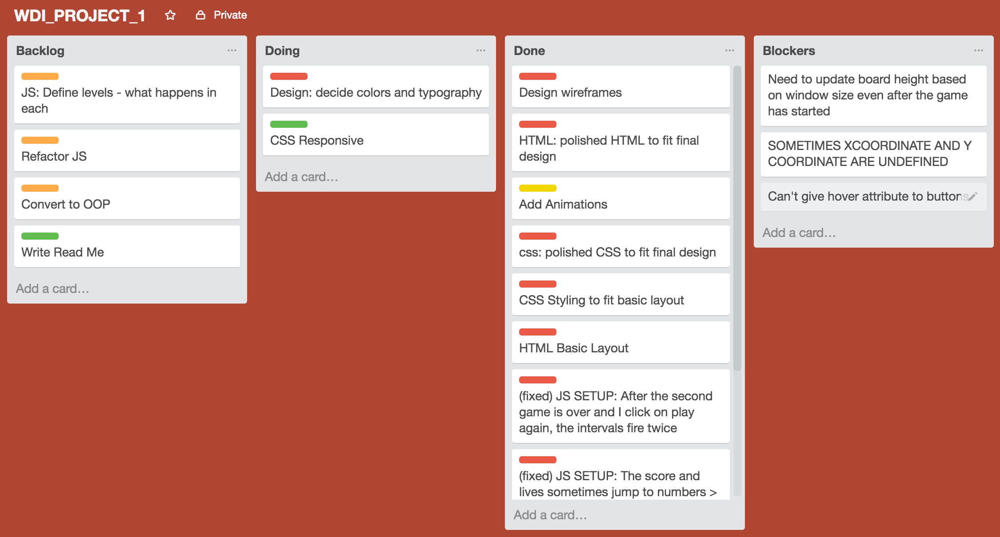

# WDI Project # 1

Thank for visiting! [Check out the game](https://young-coast-20297.herokuapp.com/)

##The game:
ColorDots is a very simple game: you have to click on the dots that have the same color as the one in the centre to gain points.

**Rules:**

- If you click on the right dot color you earn one point
- If you click on the wrong color you lose a life
- If you don't click on the right dot before it disappears you lose a life
- If you make 10 points in a row you regain a life
- If you lose 3 lives the game ends

###What I wanted to get out of this project
For this projects I wanted to stay focused on the user experience, UI, transitions and animations on the site more than the logic of the game itself. Despite this, I learned a lot about 

###Libraries used:

- jQuery
- Animate.css
- Google Fonts
- Font Awesome

 
---

Game board

---
 
##Process
I outlined my tasks on Trello, and ordered them in importance. This way, every day I would know what I had to do on the day and could see the progress.

<<<<<<< HEAD

=======

>>>>>>> 9cfce61d31a2364fe7b3205d499ec6449b67371c

- **Day 1 & Day 2**: The first step was to think about the actual rules of the game, that way I could start pseudocoding. Once I knew what the rules were, I did a really basic layout with html and css, just to have a working environment. I then started writing my JS code. The way I approached it was with continuous testing, solving each roadblock step by step. What really helped me to visualize my game in the making was sketching the game flow on a piece of paper.

- **Day 3**: Once I had my basic game working, I started thinking about the layout. I sketched out some wireframes of what I wanted my generic style to be, and put it down into code in a separate folder from where the game logic was. This allowed me to concentrate exclusively on the UI, responsiveness of the website as well as the animations. 
- **Day 4**: At this point I refactored the HTML, CSS and JS files and merged them together to have a complete game. Once that was done, I proceeded to establish what my colour palette would look like and applied it.
- **Day 5**: On the last day of our projects, I finalised the responsiveness of the website, continued refactoring and ultimately turned it into OOP.

 

##Learnings
This project allowed me to sediment all the concepts we learned during the first two weeks of class, for example:

- Styling the app using a mix of CSS and JS
- Using intervals and timeouts
- Using and applying animations using exclusively jQuery

##Challenges
One of the challenges I faced was when I 

##Future plans for the game
- Have the bubbles increase/decrease in size based on screen size, so the game is also playable in the lergest and smallest screens.
- Make the game more engaging by adding actual levels where the user has tasks to complete. For example, in level one you have to get 3 yellow dots and 4 blue ones.
- Add a better selection of sounds, and differentiate between when the user clicks on the right dot vs. the wrong one
- Add possibility to change theme of the game and changing the style based on the user selection. The styles will be inspired by famous artists like Piet Mondrian, for example.

**Thanks for watching!!**

