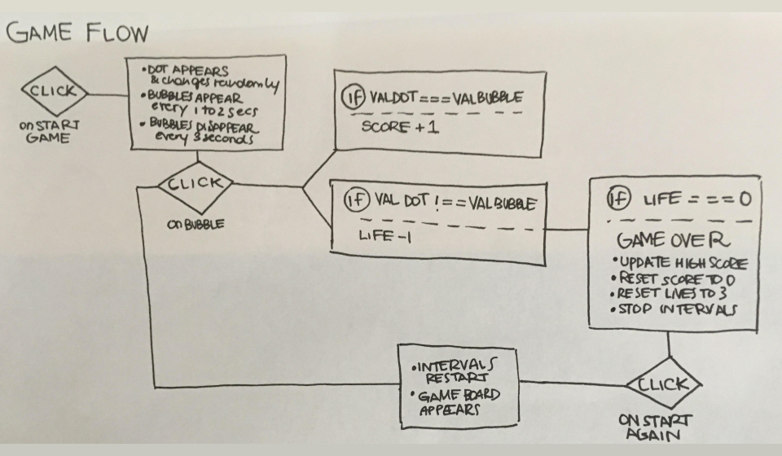

# ColorDots, My First WDI Project

Thank for visiting! [Check out the game](https://young-coast-20297.herokuapp.com/)

##The game:
The game is a very simple concept: you have to click on the dots that have the same color as the one in the centre.

My biggest focus for this task was UI and animations.

###Libraries used:

- jQuery
- Animate.css
- Google Fonts
- Font Awesome

**Rules:**

- If you click on the right dot color you earn one point
- If you click on the wrong color you lose a life
- If you don't click on the right dot before it disappears you lose a life
- If you make 10 points in a row you regain a life
- If you lose 3 lives the game ends

 
---

Game board

---
 
##Process
I outlined my tasks on Trello, and ordered them in importance. This way, every day I would know what I had to do on the day and could see the progress.

- **Day 1 & Day 2**: The first step was to think about the actual rules of the game, that way I could start pseudocoding. Once I knew what the rules were, I did a really basic layout with html and css, just to have a working environment. I then started writing my JS code. The way I approached it was with continuous testing, solving each roadblock step by step. What really helped me to visualize my game in the making was sketching the game flow on a piece of paper.

- **Day 3**: Once I had my basic game working, I started thinking about the layout. I sketched out some wireframes of what I wanted my generic style to be, and put it down into code in a separate folder from where the game logic was. This allowed me to concentrate exclusively on the UI, responsiveness of the website as well as the animations. 
- **Day 4**: At this point I refactored the HTML, CSS and JS files and merged them together to have a complete game. Once that was done, I proceeded to establish what my colour palette would look like and applied it.
- **Day 5**: On the last day of our projects, I finalised the responsiveness of the website, continued refactoring and ultimately turned it into OOP.

 

##Learnings
This project allowed me to sediment all the concepts we learned in class, for example:

- Styling the app using a mix of CSS and JS
- Using intervals and timeouts
- Using and applying animations using jQuery

**Thanks for watching!!**

